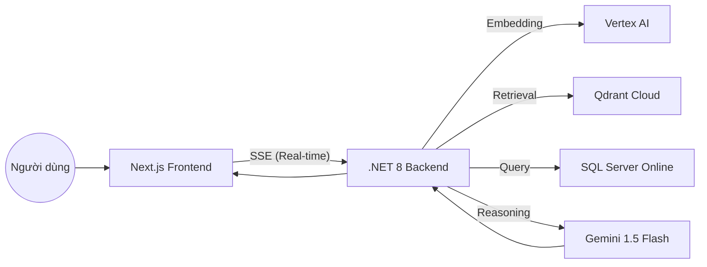

# 🤖 DODO ChatBot - Hệ thống RAG ChatBot Thông Minh

DODO ChatBot là một ứng dụng **RAG (Retrieval-Augmented Generation)** hiện đại, kết hợp sức mạnh của mô hình ngôn ngữ lớn **Gemini (Vertex AI)** với cơ sở dữ liệu Vector và SQL để cung cấp câu trả lời chính xác dựa trên dữ liệu của riêng bạn.


---

## ✨ Tính năng nổi bật

- **🔍 RAG Search (Retrieval-Augmented Generation):** Tự động tìm kiếm ngữ cảnh từ kho dữ liệu văn bản trước khi trả lời.
- **📄 Đa dạng nguồn dữ liệu:** Hỗ trợ nạp và bóc tách nội dung từ file **PDF, TXT, và JSON** thông qua Vertex AI.
- **⚡ Real-time Progress (SSE):** Theo dõi quá trình xử lý (Vectorization, Retrieval, SQL Execution) theo thời gian thực với hiệu ứng mượt mà.
- **🗄️ SQL Insight:** Khả năng hiểu cấu trúc database, tự sinh câu lệnh SQL và thực thi để lấy dữ liệu thực tế từ hệ thống.
- **🎨 Giao diện Premium:** Thiết kế theo phong cách Glassmorphism, hỗ trợ hiệu ứng Starfield, Sidebar quản lý lịch sử chat và trải nghiệm người dùng tối ưu.

---

## 🛠️ Công nghệ sử dụng

### **Frontend (Vercel)**
- **Framework:** Next.js 15+ (App Router, TypeScript)
- **Styling:** Tailwind CSS (Modern Dark Mode)
- **Animation:** Framer Motion (Micro-animations, SSE transitions)
- **Icons:** Phosphor Icons

### **Backend (Render)**
- **Framework:** .NET 8 Web API (C#)
- **AI Engine:** Google Vertex AI (Gemini 1.5 Flash, Text Embedding)
- **Vector DB:** Qdrant Cloud (Lưu trữ và tìm kiếm vector)
- **RDBMS:** SQL Server Online (Lưu trữ dữ liệu nghiệp vụ)
- **Containerization:** Docker

---

## 🏗️ Kiến trúc hệ thống



---

## 🚀 Cài đặt và Chạy Local

### 1. Yêu cầu hệ thống
- .NET 8 SDK
- Node.js 18+ & npm
- Docker (Tùy chọn, nếu muốn chạy backend qua Docker)

### 2. Thiết lập biến môi trường
Tạo file `.env` tại thư mục gốc dựa trên mẫu `.env.example`:

```bash
cp .env.example .env
```

Cập nhật các thông tin quan trọng như `VERTEX_API_KEY`, `QDRANT_HOST`, và `MSSQL_CONNECTION_STRING`.

### 3. Chạy ứng dụng

**Chạy Backend:**
```bash
cd backend
dotnet run
```
*Backend mặc định chạy tại `http://localhost:5000`*

**Chạy Frontend:**
```bash
cd frontend
npm install
npm run dev
```
*Frontend mặc định chạy tại `http://localhost:3000`*

---

## ☁️ Hướng dẫn Deployment

### **Frontend (Vercel)**
1. Kết nối Repository với Vercel.
2. Cấu hình Environment Variables:
   - `NEXT_PUBLIC_API_MODE`: `dotnet`
   - `NEXT_PUBLIC_DOTNET_API_URL`: Link Backend trên Render (VD: `https://api.onrender.com/api/chat`)

### **Backend (Render)**
1. Tạo **Web Service** mới, chọn deploy từ **Docker**.
2. Thiết lập **Root Directory** là `backend`.
3. Thiết lập **Dockerfile Path** là `./Dockerfile`.
4. Cấu hình Environment Variables (Xem chi tiết trong file `.env.example`).
5. Thêm Health Check Path: `/api/health`.

---

## 📖 Cấu trúc thư mục

- `/frontend`: Mã nguồn Next.js (Components, Hooks, Services).
- `/backend`: Mã nguồn .NET 8 (Controllers, Services, Models).
- `Dockerfile`: File cấu hình build image cho Backend.

---

## 📝 License

Dự án được phát triển bởi **TienxDun**. Vui lòng liên hệ nếu có bất kỳ thắc mắc nào!
