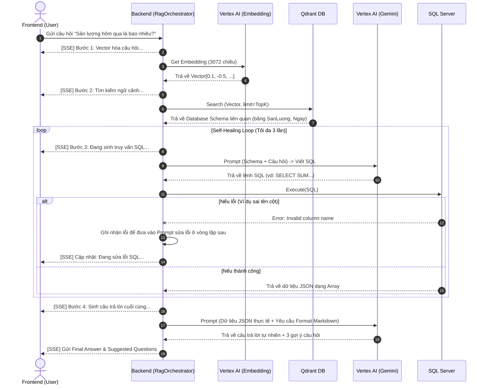
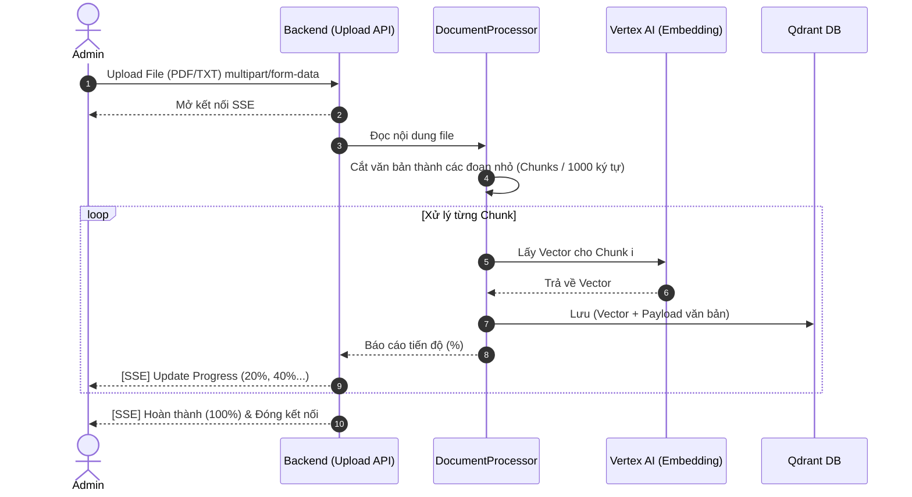

# 🏗️ DODO ChatBot - Tài liệu Kiến trúc Hệ thống (Architecture)

Tài liệu này cung cấp cái nhìn toàn diện về kiến trúc của **DODO ChatBot**, từ mức tổng quan dành cho người mới tiếp cận cho đến mức chi tiết dành cho các kỹ sư phát triển (Coder).

---

## 1. Tổng quan Hệ thống (Dành cho người mới)

**DODO ChatBot** là một hệ thống hỏi đáp thông minh dành cho doanh nghiệp (ví dụ: nhà máy sản xuất), giúp biến dữ liệu thô và cơ sở dữ liệu hiện có thành câu trả lời tự nhiên. Hệ thống hoạt động dựa trên cơ chế **RAG (Retrieval-Augmented Generation)** kết hợp với khả năng phân tích cơ sở dữ liệu (Text-to-SQL).

Nói một cách đơn giản, khi bạn đặt câu hỏi, ChatBot không tự bịa ra câu trả lời. Thay vào đó, nó sẽ:
1. Hiểu câu hỏi của bạn.
2. Lục tìm trong tài liệu (PDF, Text) hoặc trong cơ sở dữ liệu (SQL Server) để lấy số liệu thực tế.
3. Tổng hợp số liệu đó thành một câu trả lời dễ hiểu, có bảng biểu minh họa rõ ràng.

### Sơ đồ Tổng quan Mức cao (High-Level Architecture)

```mermaid
graph LR
    User((👨‍💻 Người dùng))

    subgraph Frontend [Giao diện - Next.js]
        UI[Web UI / Khung Chat]
    end

    subgraph Backend [Xử lý lõi - .NET 8]
        API[API Server & Điều phối]
    end

    subgraph Data [Lưu trữ dữ liệu]
        QDR[(Qdrant Vector DB<br/>Chứa ngữ cảnh)]
        SQL[(SQL Server<br/>Chứa số liệu kinh doanh)]
    end

    subgraph AI_Engine [Trí tuệ Nhân tạo]
        VAI[Google Vertex AI<br/>Gemini Flash & Embeddings]
    end

    User <-->|Hỏi / Nhận kết quả| UI
    UI <-->|Real-time Events (SSE)| API
    API -->|Tìm ngữ cảnh| QDR
    API -->|Lấy số liệu| SQL
    API <-->|Sinh Text & Vector| VAI
```

---

## 2. Chi tiết Kiến trúc Hệ thống (Dành cho Coder)

Hệ thống được chia làm hai phần tách biệt (Client - Server) và giao tiếp chủ yếu qua REST API và **Server-Sent Events (SSE)** để cập nhật trạng thái theo thời gian thực (real-time streaming).

### 2.1. Frontend (Next.js App Router)
- **Nhiệm vụ:** Hiển thị giao diện người dùng, xử lý trạng thái chat, render Markdown có bảng biểu và hiển thị quá trình xử lý AI theo thời gian thực.
- **Công nghệ chính:** React (Next.js App Router), Tailwind CSS (giao diện dark-mode, glassmorphism), Framer Motion (hiệu ứng mượt mà).
- **Điểm nhấn kỹ thuật:** Thay vì dùng WebSockets phức tạp, hệ thống dùng **SSE (Server-Sent Events)** thông qua Fetch API thông thường để nhận từng luồng dữ liệu (chunk) từ Backend gửi về, giúp người dùng thấy bot đang "nghĩ" ở bước nào (Vectorization -> Retrieval -> SQL Execution -> Answer).

### 2.2. Backend (.NET 8 Web API)
- **Nhiệm vụ:** Bộ não điều phối toàn bộ quá trình. Nhận Request từ Frontend, gọi các dịch vụ AI và Data, sau đó Stream kết quả về.
- **Công nghệ chính:** C# .NET 8 (Minimal APIs).
- **Các thành phần cốt lõi (Services):**
  - `RagOrchestrator`: Đạo diễn chính. Lên kịch bản cho luồng xử lý RAG kết hợp SQL Insights.
  - `VertexAiClient`: Gọi Google Cloud Vertex AI qua RESTful HTTP (mô hình Gemini 1.5 Flash cho Text, `text-embedding-004` cho Vectors).
  - `QdrantService`: Giao tiếp với Qdrant Vector DB để lưu trữ và tìm kiếm vector (Cosine Similarity).
  - `SqlService`: Kết nối và thực thi các truy vấn động trên SQL Server.
  - `DocumentProcessor`: Bóc tách văn bản (PDF, txt), chia nhỏ (chunking) và vectorize để đưa vào Qdrant.

### 2.3. Data Layer (Qdrant & SQL Server)
- **Qdrant Vector DB:** Nơi lưu trữ không gian ngữ nghĩa (Embeddings). Chứa thông tin về cấu trúc (Schema) của SQL Database hoặc các tài liệu kiến thức. Giúp AI tìm được bảng/cột phù hợp cho việc sinh lệnh SQL.
- **MSSQL Server:** Chứa dữ liệu nghiệp vụ thực tế (Ví dụ: thông tin đơn hàng, tồn kho, công nhân, máy móc).

---

## 3. Luồng hoạt động chi tiết (Flows)

Dưới đây là các luồng hoạt động chính giải thích cách hệ thống xử lý bên dưới.

### 3.1. Luồng Hỏi Đáp Thông Minh (RAG + SQL Insights)
Đây là luồng quan trọng nhất, nằm trong `RagOrchestrator.cs`. Điểm đặc biệt là cơ chế **Self-Healing SQL** (Tự sửa lỗi): Nếu AI sinh ra lệnh SQL chạy lỗi, Backend sẽ gửi thông báo lỗi lại cho AI để nó tự sinh lại câu SQL khác cho đến khi chạy thành công (tối đa 3 lần).



### 3.2. Luồng Nạp và Xử lý Tài liệu (Document Ingestion)
Luồng này xảy ra khi Admin hoặc User tải file tài liệu (PDF, TXT) lên hệ thống để bot học thêm kiến thức.



---

## 4. Tổng kết

Nhờ việc áp dụng **SSE (Server-Sent Events)**, **Vertex AI**, và **Qdrant**, DODO ChatBot mang đến một trải nghiệm hỏi đáp rất trong suốt: người dùng biết được AI đang lấy dữ liệu từ bảng nào, thực thi lệnh SQL gì, giúp nâng cao độ tin cậy (Trust) của kết quả trả về, giải quyết bài toán "Ảo giác" (Hallucination) thường gặp ở các LLMs thông thường.
