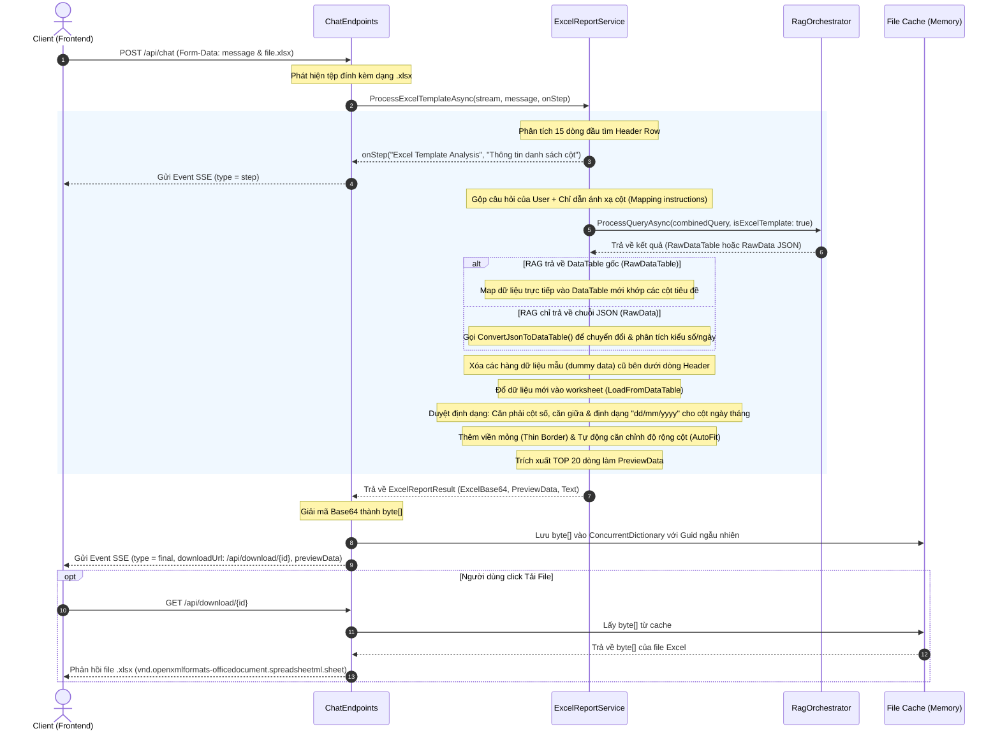
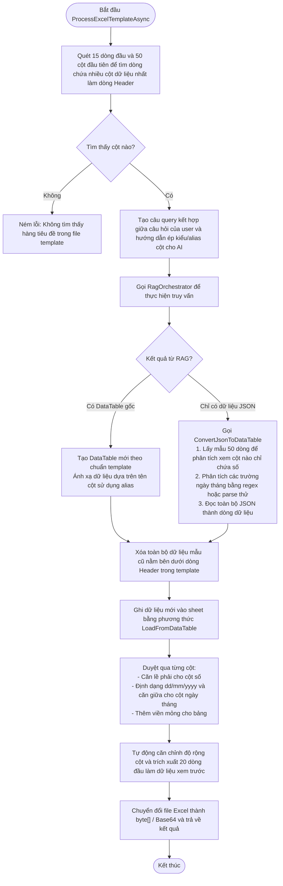
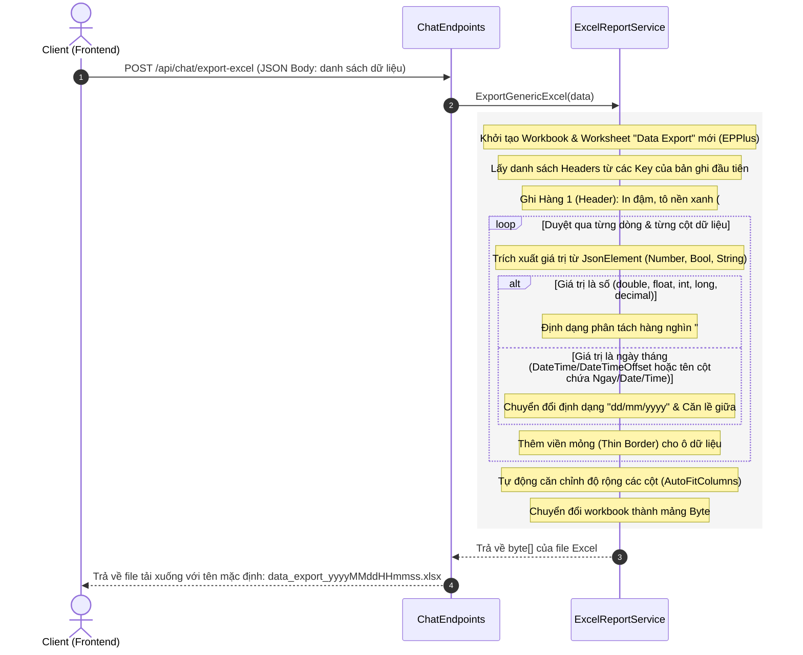

# Tài liệu Luồng Xử Lý Xuất Excel trong Hệ Thống

Tài liệu này mô tả chi tiết các luồng xử lý xuất dữ liệu ra file Excel trong hệ thống, bao gồm xuất file dựa trên Template mẫu và xuất dữ liệu lưới thông thường.

---

## 1. Luồng xuất dữ liệu theo File Excel mẫu qua Chat (Excel Template Export)

Luồng này kết hợp giữa việc phân tích cấu trúc của file Excel mẫu được tải lên và truy vấn dữ liệu động bằng cơ chế RAG để điền thông tin vào các cột tương ứng.

### Sơ đồ trình tự (Sequence Diagram)

### Chi tiết các bước xử lý nội bộ (Flowchart)

---

## 2. Luồng xuất dữ liệu dạng lưới thông thường (Generic Data Grid Export)

Áp dụng khi client có sẵn một mảng dữ liệu JSON (ví dụ kết quả hiển thị trên bảng lưới UI) và muốn tải trực tiếp về dưới dạng file Excel được định dạng sẵn.

### Sơ đồ trình tự (Sequence Diagram)

---

## 3. Các đặc điểm kỹ thuật quan trọng

* **EPPlus License**: Sử dụng giấy phép phi thương mại cho EPPlus thông qua cấu hình `ExcelPackage.License.SetNonCommercialPersonal("My Project")`.
* **Phân tích thông minh (Smart Data Parsing)**:
  * Khi xử lý file mẫu, hệ thống quét 15 hàng đầu tiên để tìm dòng chứa nhiều ô có dữ liệu nhất, dòng đó sẽ được chọn làm Header Row. Dữ liệu mẫu (dummy data) ban đầu nằm dưới Header Row này sẽ được dọn sạch hoàn toàn trước khi điền dữ liệu thực tế.
  * Khi chuyển đổi dữ liệu từ dạng JSON (`ConvertJsonToDataTable`), service lấy trước 50 bản ghi mẫu đầu tiên để tự động dò kiểu dữ liệu (`IsNumeric`) của từng cột, từ đó tự động căn phải đối với cột số, hoặc căn giữa và đặt định dạng `dd/mm/yyyy` cho cột ngày tháng.
* **Tải xuống qua Cache trung gian**: Dữ liệu file Excel tạo từ hội thoại chat được lưu trữ tạm thời trong `ConcurrentDictionary` của endpoint để người dùng có thể tải xuống thông qua định danh duy nhất (Guid) mà không cần gửi lại toàn bộ file qua luồng SSE.
