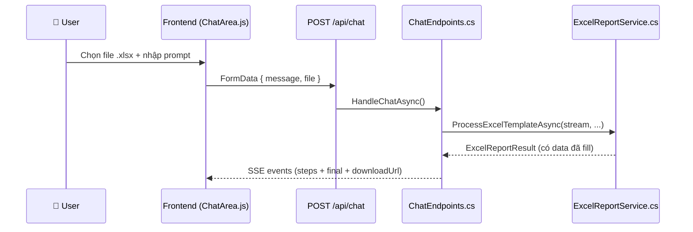
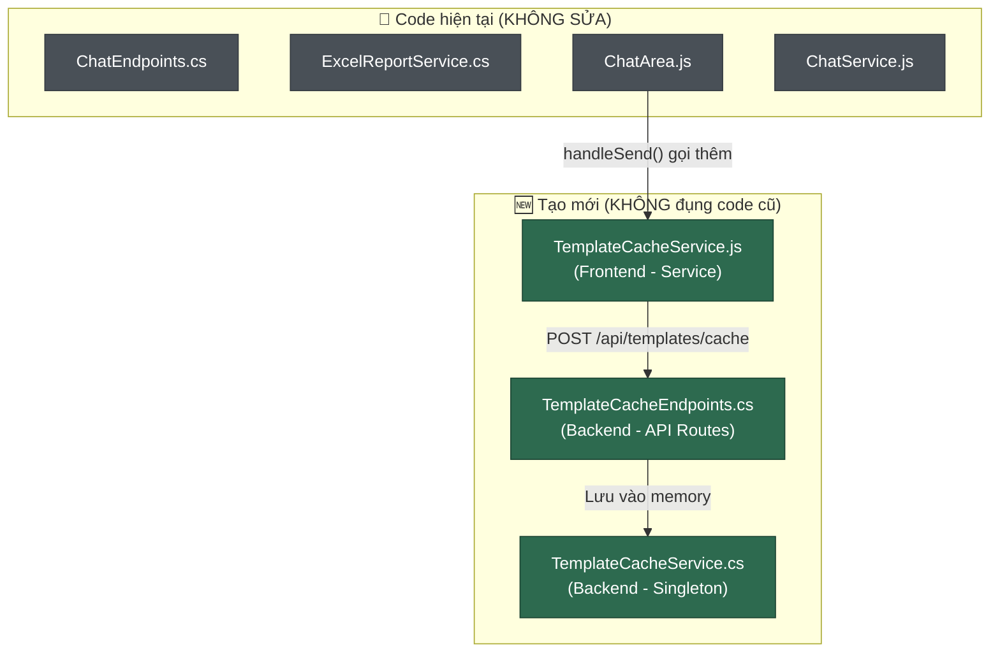
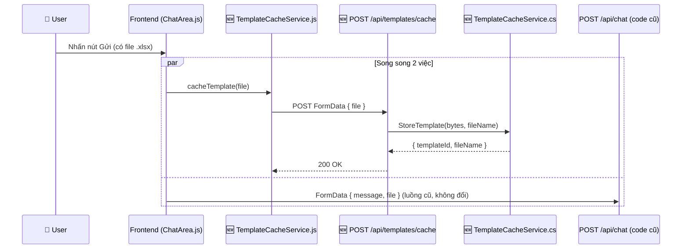

# 📋 Kế Hoạch: Excel Template Cache Service

> **Mục tiêu:** Tạo service riêng biệt để lưu file Excel template trống vào bộ nhớ đệm (in-memory array) khi người dùng nhấn nút gửi prompt kèm file.  
> **Nguyên tắc:** KHÔNG chỉnh sửa code cũ. Tạo file mới 100%.

---

## 1. Phân Tích Kiến Trúc Hiện Tại

### Luồng hiện tại khi user gửi file Excel + prompt:



### Vấn đề cần giải quyết

Hiện tại, file template gốc (trống) **không được lưu lại**. Sau khi `ExcelReportService` xử lý xong, chỉ có file **đã điền dữ liệu** được cache trong `_fileCache` của `ChatEndpoints.cs` (dòng 68-70). Template gốc bị mất.

---

## 2. Thiết Kế Service Mới

### Kiến trúc tổng quan



### Luồng mới khi user gửi file Excel + prompt:



---

## 3. Chi Tiết Từng File Cần Tạo

### 📦 File 1: `backend/Services/TemplateCacheService.cs`

**Đường dẫn:** `e:\thuctap\RAG_ChatBot\backend\Services\TemplateCacheService.cs`

**Mục đích:** Service Singleton quản lý in-memory array chứa các template Excel trống.

**Thiết kế:**

```csharp
// Cấu trúc dữ liệu cho mỗi template được cache
public class CachedTemplate
{
    public string Id { get; set; }           // GUID unique
    public string FileName { get; set; }     // Tên file gốc
    public byte[] FileBytes { get; set; }    // Nội dung file (byte array)
    public DateTime CachedAt { get; set; }   // Thời điểm lưu cache
    public long FileSize { get; set; }       // Kích thước (bytes)
}
```

**API của service:**

| Method | Mô tả |
|--------|--------|
| `StoreTemplate(byte[] bytes, string fileName)` | Lưu template vào array, trả về `CachedTemplate` |
| `GetTemplate(string id)` | Lấy template theo ID |
| `GetAllTemplates()` | Liệt kê tất cả template đã cache |
| `RemoveTemplate(string id)` | Xoá 1 template |
| `ClearAll()` | Xoá toàn bộ cache |
| `GetCacheStats()` | Trả về thống kê (số lượng, tổng dung lượng) |

**Quy tắc:**
- Dùng `List<CachedTemplate>` + `lock` hoặc `ConcurrentBag` để thread-safe
- Giới hạn tối đa **20 templates** trong cache (FIFO - xoá cũ nhất khi đầy)
- Giới hạn file size tối đa **10MB** mỗi file
- Đăng ký là **Singleton** trong DI container

---

### 📦 File 2: `backend/Endpoints/TemplateCacheEndpoints.cs`

**Đường dẫn:** `e:\thuctap\RAG_ChatBot\backend\Endpoints\TemplateCacheEndpoints.cs`

**Mục đích:** Định nghĩa các API endpoint riêng cho template cache.

**Endpoints:**

| Method | Route | Mô tả |
|--------|-------|--------|
| `POST` | `/api/templates/cache` | Upload và cache file template trống |
| `GET` | `/api/templates/cache` | Liệt kê tất cả template đã cache |
| `GET` | `/api/templates/cache/{id}` | Tải xuống template gốc theo ID |
| `DELETE` | `/api/templates/cache/{id}` | Xoá 1 template |
| `DELETE` | `/api/templates/cache` | Xoá toàn bộ cache |

**Chi tiết endpoint chính (`POST /api/templates/cache`):**

```
Request:  multipart/form-data { file: .xlsx }
Response: 200 OK { id, fileName, fileSize, cachedAt }
Error:    400 Bad Request { error: "..." }
```

---

### 📦 File 3: `frontend_vanilla/assets/js/services/TemplateCacheService.js`

**Đường dẫn:** `e:\thuctap\RAG_ChatBot\frontend_vanilla\assets\js\services\TemplateCacheService.js`

**Mục đích:** Service frontend gọi API cache template, được trigger từ `ChatArea.js`.

**API:**

```javascript
export class TemplateCacheService {
    // Gửi file template trống lên server để cache
    static async cacheTemplate(file) { ... }
    
    // Lấy danh sách template đã cache (nếu cần hiển thị)
    static async getAll() { ... }
}
```

---

## 4. Điểm Tích Hợp Duy Nhất (Code cũ)

> [!IMPORTANT]
> Đây là điểm DUY NHẤT cần chỉnh sửa code hiện tại. Tất cả logic mới đều nằm trong các file riêng.

### 4a. `Program.cs` — Đăng ký DI + Map Routes

Cần thêm **3 dòng** vào `Program.cs`:

```diff
 // --- DI Registration (khoảng dòng 33) ---
 builder.Services.AddScoped<ExcelReportService>();
+builder.Services.AddSingleton<TemplateCacheService>();

 // --- Route Mapping (khoảng dòng 123, sau các route hiện có) ---
+// Template Cache API
+TemplateCacheEndpoints.MapRoutes(app);
```

### 4b. `ChatArea.js` — Gọi cache service khi gửi

Cần thêm **2 dòng** vào method `handleSend()` (khoảng dòng 293):

```diff
  const currentFile = this.uiState.selectedFile;
+ // 🆕 Cache template trống song song (fire-and-forget)
+ if (currentFile) TemplateCacheService.cacheTemplate(currentFile);
  chatInput.value = '';
```

Và thêm **1 dòng import** ở đầu file:

```diff
 import { ChatService } from '../services/ChatService.js';
 import { InteractionService } from '../services/InteractionService.js';
+import { TemplateCacheService } from '../services/TemplateCacheService.js';
```

---

## 5. Thứ Tự Triển Khai

| Bước | File | Hành Động | Ước lượng |
|------|------|-----------|-----------|
| **1** | `backend/Services/TemplateCacheService.cs` | ✏️ Tạo mới | ~80 dòng |
| **2** | `backend/Endpoints/TemplateCacheEndpoints.cs` | ✏️ Tạo mới | ~90 dòng |
| **3** | `backend/Program.cs` | ➕ Thêm 3 dòng (DI + routes) | 3 dòng |
| **4** | `frontend/services/TemplateCacheService.js` | ✏️ Tạo mới | ~30 dòng |
| **5** | `frontend/components/ChatArea.js` | ➕ Thêm 3 dòng (import + gọi cache) | 3 dòng |
| **6** | Test thủ công | 🧪 Upload file + kiểm tra cache | - |

---

## 6. Kiểm Tra & Xác Minh

### Test Cases

| # | Scenario | Expected |
|---|----------|----------|
| 1 | Gửi prompt + file .xlsx | File template gốc được cache, đồng thời chat hoạt động bình thường |
| 2 | Gửi prompt không có file | Không gọi cache service, chat bình thường |
| 3 | `GET /api/templates/cache` | Trả về danh sách template đã cache |
| 4 | `GET /api/templates/cache/{id}` | Tải được file template gốc (trống) |
| 5 | Cache quá 20 file | Template cũ nhất bị xoá tự động (FIFO) |
| 6 | Upload file > 10MB | Trả về 400 Bad Request |
| 7 | `DELETE /api/templates/cache/{id}` | Xoá thành công, `GET` không còn thấy |

### Swagger Verification

Sau khi triển khai, truy cập Swagger UI để test các endpoint mới:
- `POST /api/templates/cache`
- `GET /api/templates/cache`
- `GET /api/templates/cache/{id}`
- `DELETE /api/templates/cache/{id}`

---

## 7. Lưu Ý Quan Trọng

> [!WARNING]
> **In-memory cache sẽ mất khi restart server.** Nếu sau này cần persist, có thể mở rộng sang lưu file vào disk hoặc database mà không ảnh hưởng interface hiện tại.

> [!NOTE]
> **Fire-and-forget pattern:** Frontend gọi `cacheTemplate()` nhưng KHÔNG await kết quả. Luồng chat chính không bị block hay chậm lại bởi việc cache. Nếu cache thất bại, chat vẫn hoạt động bình thường.

> [!TIP]
> **Mở rộng tương lai:** Service này có thể được sử dụng để cho phép người dùng "re-use" template đã gửi trước đó mà không cần upload lại, hoặc để so sánh template gốc vs template đã điền data.
