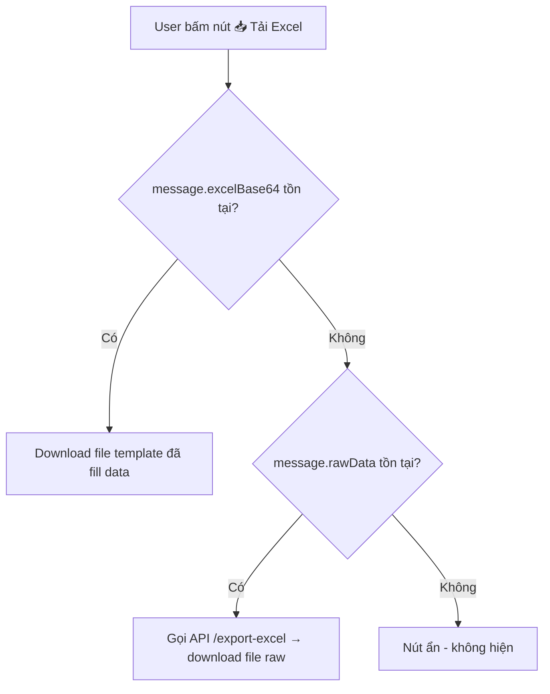

# 📋 Kế hoạch gộp 2 nút Download thành 1

## Hiện trạng

Hiện tại trong `ChatMessage.tsx` có **2 nút riêng biệt**:

| Nút | Điều kiện hiện | Hành vi |
|-----|---------------|---------|
| 🟢 **Xuất Excel** | `message.rawData` tồn tại | Gọi API `/export-excel` → download file mới từ dữ liệu thô |
| 🟢 **Tải báo cáo** | `message.excelBase64` tồn tại | Decode Base64 → download file template đã fill data |

## Mục tiêu

Gộp thành **1 nút duy nhất** với tên hiển thị và logic tự rẽ nhánh:



---

## Chỉ sửa 1 file: `ChatMessage.tsx`

### Thay đổi chi tiết

| # | Thay đổi | Chi tiết |
|---|----------|----------|
| 1 | Gộp 2 hàm `onExportExcel` + `onDownloadReport` | Thành 1 hàm `onDownloadExcel` duy nhất |
| 2 | Logic rẽ nhánh bên trong | Ưu tiên `excelBase64` (template) → fallback `rawData` (raw export) |
| 3 | Gộp 2 nút thành 1 | Điều kiện hiện: `rawData ∥ excelBase64` |
| 4 | Label thông minh | Có template → "Tải báo cáo" / Không template → "Xuất Excel" |

### Pseudo-code

```tsx
// 1 hàm duy nhất
const onDownloadExcel = useCallback(async () => {
  if (message.excelBase64) {
    // Nhánh 1: Có template đã fill → decode Base64 trực tiếp
    decode(base64) → blob → download("filled_report_xxx.xlsx")
  } else if (message.rawData) {
    // Nhánh 2: Không có template → gọi API export từ data thô
    fetch("/api/chat/export-excel", rawData) → blob → download("data_export_xxx.xlsx")
  }
}, [message.excelBase64, message.rawData]);

// 1 nút duy nhất
{(message.rawData || message.excelBase64) && (
  <button onClick={onDownloadExcel}>
    <FileXls />
    {message.excelBase64 ? "Tải báo cáo" : "Xuất Excel"}
  </button>
)}
```

---

## Kết quả trải nghiệm người dùng

### Scenario 1: Chat thường (không đính kèm file)
```
User: "Doanh thu tháng này?"
AI trả lời + hiện nút [📥 Xuất Excel]
→ Click → Gọi API export → Download file data_export_xxx.xlsx
```

### Scenario 2: Chat + Template Excel
```
User: "Xuất báo cáo top sản phẩm" + 📎 BaoCao_Template.xlsx
AI trả lời + hiện nút [📥 Tải báo cáo]
→ Click → Decode Base64 → Download file filled_report_xxx.xlsx
```

> [!TIP]
> Chỉ sửa **1 file duy nhất** (`ChatMessage.tsx`), không cần thay đổi backend hay các file khác.
