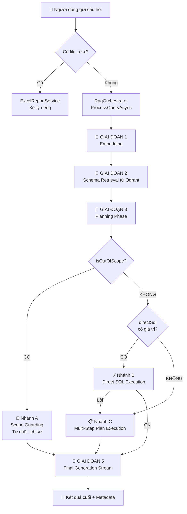

# 🔄 Luồng Thực Thi RAG ChatBot — Từ Câu Hỏi → Câu Trả Lời

## Tổng quan kiến trúc

Hệ thống nhận câu hỏi qua **Server-Sent Events (SSE)** và xử lý theo pipeline 5 giai đoạn.  
Mỗi bước đều **stream ngay lập tức** về client thay vì chờ toàn bộ xong mới trả về.

---

## 🗺️ Sơ đồ luồng tổng thể



---

## 📡 Cơ chế phản hồi: Server-Sent Events

Toàn bộ pipeline phản hồi theo 3 loại event:

| Event Type | Thời điểm | Nội dung |
|---|---|---|
| `type: "step"` | Sau mỗi bước xử lý | Tên bước + mô tả tiến trình |
| `type: "chunk"` | Trong khi AI đang sinh câu trả lời | Từng mảnh văn bản stream |
| `type: "final"` | Sau khi hoàn tất toàn bộ | Text đầy đủ + rawData + suggestedQuestions + metadata |
| `type: "error"` | Khi có lỗi | Thông báo lỗi |

---

## 📍 GIAI ĐOẠN 1 — Embedding (Vectorization)

**File:** [`RagOrchestrator.cs` L63–L121](file:///c:/Users/leuti/Desktop/GitHub/Demo/backend/Services/RagOrchestrator.cs#L63-L121)

```
userQuery → embeddingText (cắt ngắn nếu > 2000 ký tự)
         → VertexAiClient.GetEmbeddingAsync()
         → vector[3072 chiều]
```

**Đặc điểm:**
- Retry tối đa **3 lần** với exponential backoff (2s, 4s)
- Timeout toàn pipeline là **60 giây**
- Nếu là Excel template: cắt bỏ phần "DANH SÁCH Ý NGHĨA" trước khi embed

**Context tạo ra:** `vector[]` — dùng để tìm kiếm Qdrant

---

## 📍 GIAI ĐOẠN 2 — Schema Retrieval từ Qdrant

**File:** [`RagOrchestrator.cs` L123–L151](file:///c:/Users/leuti/Desktop/GitHub/Demo/backend/Services/RagOrchestrator.cs#L123-L151)

```
vector[] → QdrantService.SearchSchemaAsync(topK)
         → schemaContexts[] (markdown từng bảng/cột)
         → sắp xếp theo alphabet
         → CompressSchemaMarkdown() — loại bỏ ví dụ SAI, nén cột
         → schemaInfo (string)
```

**Đặc điểm:**
- Lấy `TopK` schema chunks gần nhất với câu hỏi (semantic search)
- Nén schema để tiết kiệm token: bảng markdown → danh sách `- ColName (Type, Role): Desc`
- Loại bỏ các dòng "Ví dụ SAI" khỏi prompt

**Context tạo ra:** `schemaInfo` — cấu trúc database liên quan, dùng cho Planning + SQL Generation

---

## 📍 GIAI ĐOẠN 3 — Planning Phase (AI phân tích & lập kế hoạch)

**File:** [`RagOrchestrator.cs` L158–L230](file:///c:/Users/leuti/Desktop/GitHub/Demo/backend/Services/RagOrchestrator.cs#L158-L230)

```
userQuery + schemaInfo + globalRules + currentTime
    → AI GenerateContent (JSON mode)
    → planJson: { isOutOfScope, reason, steps[], directSql }
```

**Context được đưa vào prompt:**
- `schemaInfo` — cấu trúc DB vừa tìm được từ Qdrant
- `globalRules` — rules từ file `_global_rules.json` (cached, reload khi file thay đổi)
- `currentTimeStr` — giờ VN (UTC+7) để xử lý "gần đây", "hôm nay"
- `userQuery` — câu hỏi gốc

**AI trả về JSON gồm:**
| Trường | Mô tả |
|---|---|
| `isOutOfScope` | true/false — câu hỏi có liên quan DB không |
| `reason` | Lý do / giả định khi lập kế hoạch |
| `steps[]` | Danh sách bước cần thực thi (tối đa 3) |
| `directSql` | SQL trực tiếp nếu chỉ cần 1 bước đơn giản |

---

## 📍 GIAI ĐOẠN 4 — Execution (3 nhánh)

### 🚫 Nhánh A: Out-of-Scope
```
isOutOfScope = true
    → Bỏ qua toàn bộ SQL
    → workingContext = rỗng
    → Final prompt biết để từ chối lịch sự
```

---

### ⚡ Nhánh B: Direct SQL Execution
**File:** [`SqlPlanExecutor.cs` L160–L198](file:///c:/Users/leuti/Desktop/GitHub/Demo/backend/Services/Rag/SqlPlanExecutor.cs#L160-L198)

**Khi nào:** Planning AI trả về `directSql` có giá trị (câu hỏi đơn giản, 1 SQL là đủ)

```
directSql (từ Planning AI)
    → CleanSql() — loại bỏ markdown wrapper
    → SqlService.ExecuteQueryAsDataTableAsync()
    → BuildStepOutput() → fullJson + uiJson (tối đa 10 dòng hiển thị)
    → workingContext += kết quả
```

**Nếu lỗi:** Tự động **fallback sang Nhánh C** (Multi-Step)

---

### 📋 Nhánh C: Multi-Step Plan Execution
**File:** [`SqlPlanExecutor.cs` L65–L158](file:///c:/Users/leuti/Desktop/GitHub/Demo/backend/Services/Rag/SqlPlanExecutor.cs#L65-L158)

**Khi nào:** Câu hỏi phức tạp cần nhiều bước, hoặc Direct SQL thất bại

```
Với mỗi step trong stepsToExecute[]:
    sqlPrompt = schemaInfo + workingContext (bước trước) + globalRules + currentTime + stepDesc
        → AI GenerateContent → generatedSQL
        → CleanSql()
        → SqlService.ExecuteQueryAsDataTableAsync()
        → BuildStepOutput()
        → GetCompactContext() → thêm vào workingContext cho bước tiếp theo
        → Retry tối đa 3 lần nếu SQL lỗi
```

**Context tích lũy giữa các bước:**

```
workingContext = "KẾT QUẢ CÁC BƯỚC TRƯỚC ĐÓ:"
               + "[Kết quả Step 1/2: ...]" + data bước 1
               + "[Kết quả Step 2/2: ...]" + data bước 2
```

> ⚠️ **Dữ liệu lớn (>15 dòng):** `GetCompactContext()` chỉ giữ 5 dòng mẫu + TotalRows  
> để tránh overflow token khi truyền vào prompt bước tiếp theo

---

## 📍 GIAI ĐOẠN 5 — Final Generation (Stream)

**File:** [`RagOrchestrator.cs` L315–L468](file:///c:/Users/leuti/Desktop/GitHub/Demo/backend/Services/RagOrchestrator.cs#L315-L468)

**Chạy song song 2 task:**

```
Task 1 (Stream):        finalPrompt → AI Stream → chunks → client (SSE)
Task 2 (Background):    metadataPrompt → AI → columnMapping / excelData (để export Excel)
```

**Context đưa vào finalPrompt:**
| Dữ liệu | Nguồn |
|---|---|
| `userQuery` | Câu hỏi gốc |
| `isOutOfScope` | Kết quả từ Planning |
| `planningReason` | Lý do / giả định từ Planning |
| `workingContext` | Kết quả SQL tổng hợp từ Giai đoạn 4 |
| `currentTimeStr` | Giờ hiện tại VN |

**Prompt bắt buộc AI:**
- **Không tự bịa số liệu** — chỉ dùng dữ liệu trong `workingContext`
- Nếu dữ liệu bị nén (`WarningRules`): dùng `TotalRows`, không đếm dòng mẫu
- Trình bày Markdown: `### 💠 Tổng quan` + `### 📋 Chi tiết`
- Format số, ngày, tỷ lệ theo quy tắc cụ thể

---

## 🗂️ Context Summary — Xây dựng qua từng bước

```
Giai đoạn    Dữ liệu mới thêm vào                  Dùng ở đâu
─────────────────────────────────────────────────────────────────
1. Embed     vector[3072]                            → Qdrant search
2. Schema    schemaInfo (schema chunks từ Qdrant)    → Planning prompt
                                                     → SQL generation prompt
3. Planning  isOutOfScope, reason, steps, directSql → Routing nhánh
             globalRules (từ file JSON)              → SQL prompt
             currentTimeStr                          → Planning + SQL prompt
4. Execution workingContext (kết quả SQL tích lũy)  → Final prompt
             lastDataTable (DataTable đầy đủ)        → Metadata prompt
             lastStepJson (JSON đầy đủ)              → rawData export
5. Final     finalText (Markdown stream)             → Client
             metadata (performance)                 → Client
             rawDataForExport (columnMapping/data)  → Client (export Excel)
```

---

## ⏱️ Performance Tracking

Khi `isTestPerformance = true`, hệ thống đo từng giai đoạn:

| Phase | Đo |
|---|---|
| `EmbeddingMs` | Thời gian gọi Vertex AI embedding |
| `SchemaRetrievalMs` | Thời gian tìm Qdrant |
| `PlanningMs` | Thời gian AI lập kế hoạch |
| `ExecutionMs` | Thời gian sinh + chạy SQL |
| `GenerationMs` | Thời gian AI stream câu trả lời |
| `TotalMs` | Tổng toàn pipeline |

Kết quả trả về trong `response.metadata` về phía client.
